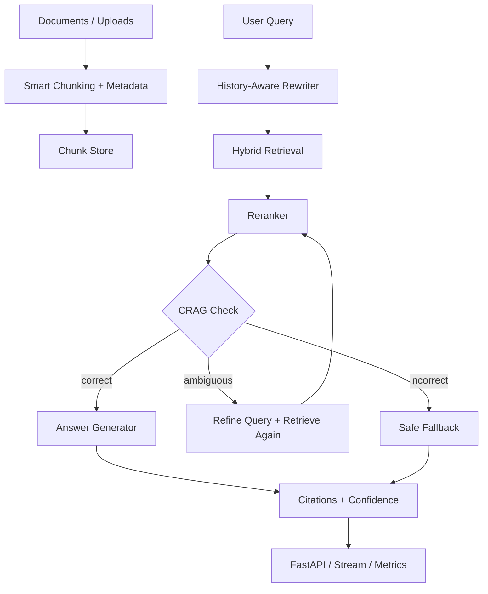

# Architecture

## Overview

## Major Components

### Ingestion

- type-aware chunking based on document type
- metadata stored with each chunk

### Retrieval

- semantic-style overlap score
- keyword score
- weighted hybrid score

### Reranking

- improves precision after broad retrieval
- favors title and category alignment

### Session Memory

- keeps recent user/assistant turns
- rewrites vague follow-ups into standalone queries

### CRAG Branch

- `correct` -> answer directly
- `ambiguous` -> refine and retry
- `incorrect` -> safe fallback

### Production Layer

- FastAPI endpoints
- exact + semantic cache
- streaming endpoint
- upload path
- health and metrics
- built-in evaluation route
